# CELS

## 一、项目介绍

本项目实现一个英语学习小程序，在终端显示页面，功能如下

### 欢迎界面


### 主菜单


选择想要进入的功能

### 1.浏览基库

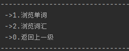

#### 1.1 浏览单词


单词根据首字母分组，显示各组数量，输入想看的字母，会得到该首字母所有单词

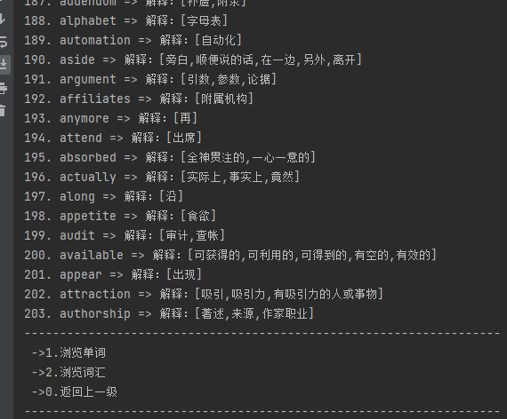

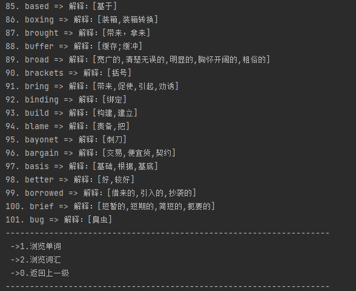

#### 1.2 浏览词汇

词汇vocabulary经过分页会分页显示，每页15个词汇


选择想要查看的页码，可以显示词汇和页面信息

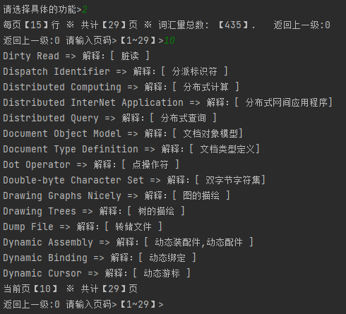

### 2.做游戏学习单词

功能菜单

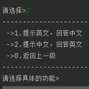

#### 2.1 英译中

选择是否从上次的断点继续，若否，则重新加载试题

每个单词有多个中文解释，答对一个则算对

每次答完会进行统计

按e或q退出

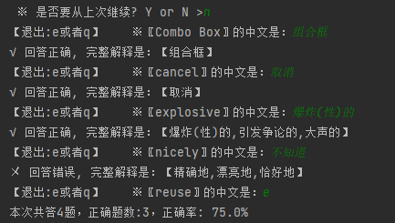

下图接上图，可以回到上次的断点

如果一题不答，则输出吐槽内容


#### 2.2 中译英

中译英与英译中功能相同

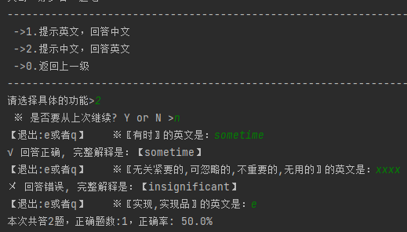

### 3.测试自己的水平

测试菜单


#### 3.1 测试功能

最开始选择想要测试的题目数量，若超出范围会重新选择

测试途中也可以退出，测试记录会被保存

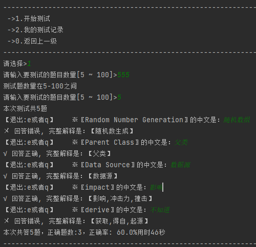

#### 3.2 测试记录功能

查看测试记录，按照测试时间降序排列

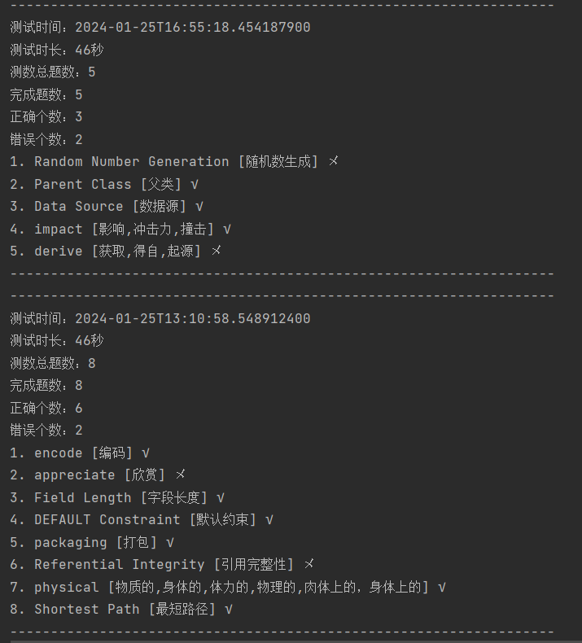

### 4.生词本

生词本菜单

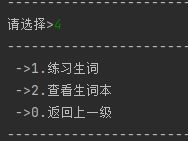

#### 4.1练习生词

可看到生词本中有多少生词，选择指定数量的生词进行练习


#### 4.2查看生词本

可查看生词本记录，在游戏和测试功能中答错的单词都会被记录进生词本，被记录过的生词不会重复记录

在练习生词功能中，同一生词答对3次，则会从生词本中移除


### 5.退出

所有子目录按0都会返回上一级目录，在主菜单按0则程序结束


## 二、知识点&经验整理

### 1.软件架构规范

遵循数据流沿着：持久层、业务层、控制层、表现层逐级上跑，不应越级

各层职责应当清晰，每一层只能调取自己下面层级的方法

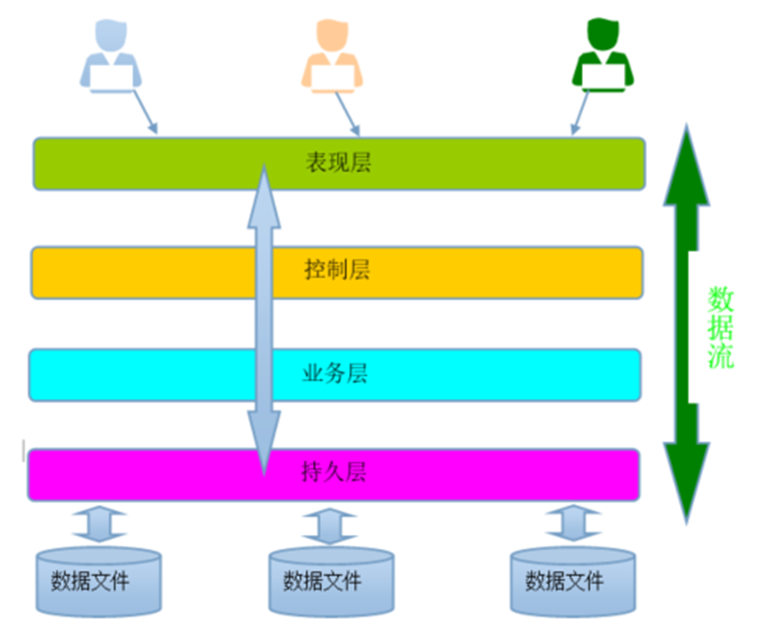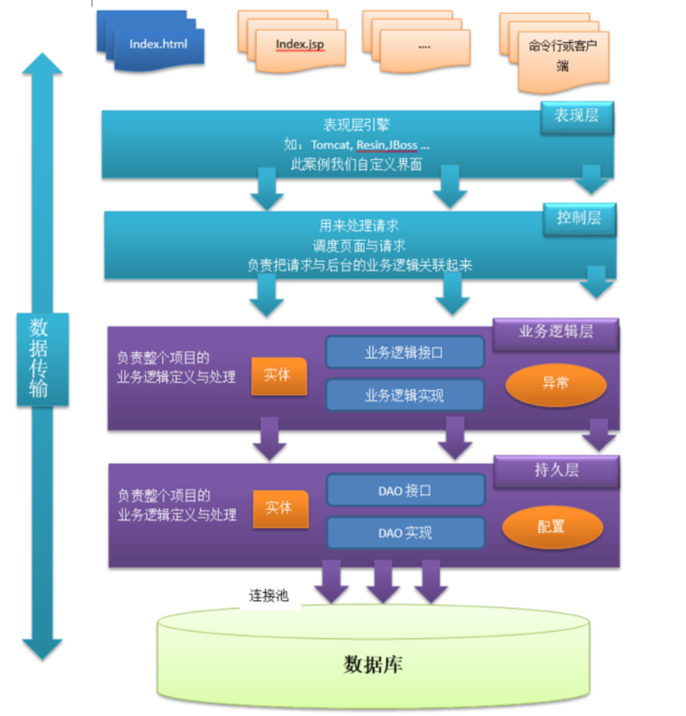

### 2.文件IO知识点

#### 2.1 写入操作

在写入操作时，如果文件不存在，会自动创建，因此只需要保证文件目录存在

```java
        //创建File对象
        File file = new File(fileName);

        //判断此file目录是否存在
        if(!file.getParentFile().exists()) {
            file.getParentFile().mkdirs();
        }
```


对象流写入放进try的括号里，可以确保在程序完成后自动关闭流资源，而无需手动调用 close() 方法

即使在写入过程中抛出了异常，也能保证最终资源会被正确释放，防止了因忘记关闭流而导致的资源泄漏问题

```java
        //利用利用对象流完成写入
        try (ObjectOutputStream out = new ObjectOutputStream(new FileOutputStream(file))){
            out.writeObject(notes);
        }
        //处理异常
        catch (Exception e) {
            e.printStackTrace();
        }
```

#### 2.2 读取操作

读取操作时经常会抛出EOFException，因此需要对异常和返回的数据有严格处理

此处有返回值为null的情况，则需要后续调用时对null进行处理

```java
    @Override
    public Map<String, String> readFromFile(String fileName) {
        //判断 fileName是否存在
        if(!new File(fileName).exists()) {
            return null;
        }
        // 调用readObject方法直接读到
        try ( ObjectInputStream in = new ObjectInputStream(new FileInputStream(fileName))){
            Map<String, String> map = (Map<String, String>) in.readObject();
            return map;
        }catch (Exception e){
            e.printStackTrace();
        }
        // 正常返回
        return null;
    }
```

### 3.异常类

#### 3.1 自定义异常类

```java
public class NoHistoryException extends Exception{
    public NoHistoryException() {
        super();
    }
    //构造异常时可以传递参数message，在后续的步骤中可以获取 e.getMessage()
    public NoHistoryException(String message) {
        super(message);
    }
    //cause 指的是引发当前异常的原始异常或错误
    public NoHistoryException(String message, Throwable cause) {
        super(message, cause);
    }
    public NoHistoryException(Throwable cause) {
        super(cause);
    }
}

```

#### 3.2 抛出异常

代码逐次调用会逐次抛出异常，直到有方法捕获异常并处理

**throws**

用法：出现在方法签名的后面，跟着可能抛出的异常类型列表。

功能：声明该方法可能会抛出某种类型的异常，这些异常需要由调用这个方法的代码来捕获处理。也就是说，方法不处理这些异                        常，而是将异常处理的责任转移给了上层调用者。

**throw**

用法：出现在方法体内，用来主动抛出一个具体的异常实例。

功能：当满足特定条件或发生错误时，程序员通过 throw 关键字手动创建并抛出一个异常对象，立即结束当前方法的执行，并将控制权转移到能捕获该异常的最近的 try-catch 块或者包含该方法调用的上级作用域（如果它声明了抛出该异常）。

```java
    @Override
    public List<Note> getNote() throws NoNoteException {

        File t = new File(NOTE_DIR);
        if(!t.exists()){
            throw new NoNoteException("生词本目录不存在");
        }
        File tr = new File(NOTE_DIR,NOTE_FILE);
        if(!tr.exists()){
            throw new NoNoteException("生词本文件不存在");
        }

        return noteDao.readNote(tr.getAbsolutePath());
    }
```


### 4.小知识点归纳

#### 4.1 字符串拼接

此处需要将baseTerms中的所有BaseTerm对象取出，将其中英文分别作为key和value存入map中方便后续答题

```java
            List<BaseTerm> baseTerms = init();
            Map <String, String> map = new HashMap<>();
            for (BaseTerm baseTerm : baseTerms) {
                String key = baseTerm.getEn();
                
                //利用StringBuilder拼接字符串
                StringBuilder builder = new StringBuilder();
                for (String s : baseTerm.getCn()) {
                    //trim()方法去除空格
                    builder.append(s.trim()).append(",");
                }
                builder.deleteCharAt(builder.length()-1);
                map.put(key,builder.toString());
            }
```

#### 4.2 字符串分割

此处是从文件中获取一行内容，通过分割字符串，设置需要的值

该文件格式如下，中英文间用"#"隔开，多个中文意思用":"隔开

```tex
CHECK Constraints#检测约束:检查约束 
Check Box#复选框 
Check Button#复选按钮
```

```java
            String line;
            //readLine()方法会持续读取输入流直至遇到换行符（\n）、回车符（\r）或者到达文件末尾
            while( (line = reader.readLine()) != null) {
                //防止出现多个"#"，"+"号表示一个或多个
                String[] parts = line.split("#+");
                String en = parts[0];
                //防止出现多个":"，"+"号表示一个或多个
                String[] cn = parts[1].split(":+");
                Vocabulary vocabulary = new Vocabulary(en, cn);
                vocabularies.add(vocabulary);
            }
```

#### 4.3 Scanner

```java
    /**********************
     * 获取用户输入的整数，如果输入的类型不是int，则重新输入
     * @param prompt 提示信息
     * @return 用户输入的整形
     */
    public static int getInt(String prompt) {
        System.out.print(prompt);
       
        try {
            //读取整行
            String s = scanner.nextLine();
            //将结果转化为整形
            int result = Integer.parseInt(s);
            return result;
        } catch (Exception e) {
            //如果输入的不是整形，则进入catch
            System.out.println("输入的不是整数");
            //递归调用方法，重新获取输入值
            return getInt(prompt);
        }
    }
```

